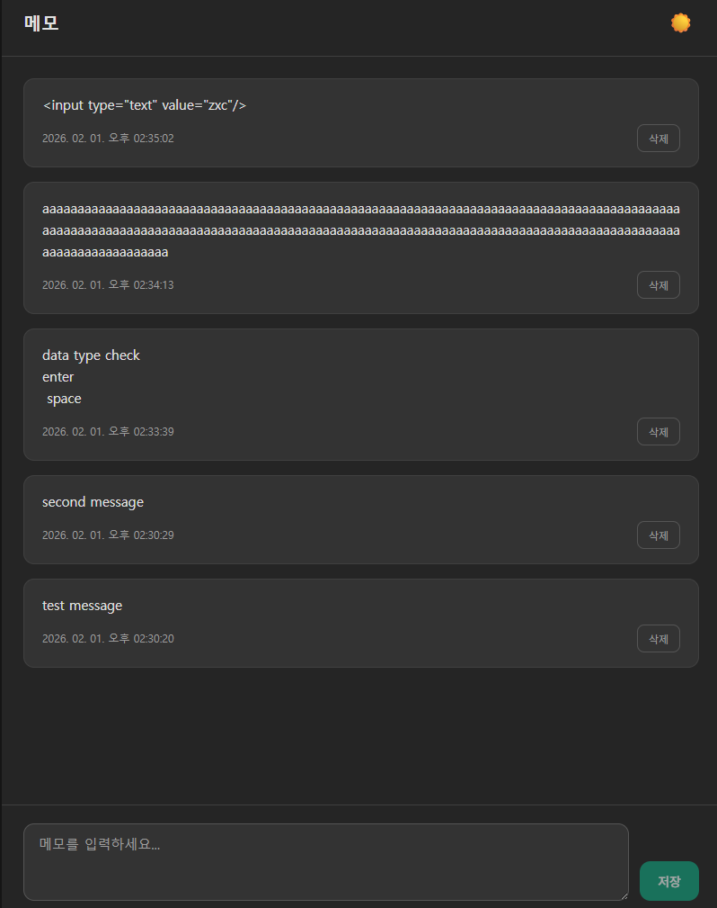

# 메모 (Next.js + SQLite)

ChatGPT처럼 메모를 입력하면 **현재 날짜·시간**과 함께 DB에 저장되고, 다시 열어도 목록에서 조회할 수 있는 프로젝트입니다.

## 미리보기



## 기술 스택

- Next.js (App Router), TypeScript
- Prisma + SQLite (파일 DB, 별도 서버 불필요)

## 실행 방법

```bash
cd memo
npm install
npx prisma generate
npx prisma db push
npm run dev
```

브라우저에서 [http://localhost:3000](http://localhost:3000) 접속.

## 기능

- **메모 입력**: 하단 입력창에 내용 입력 후 "저장" 클릭 (또는 Enter)
- **날짜/시간**: 서버에서 저장 시점의 `createdAt`이 자동 기록됨
- **목록 조회**: 저장된 메모가 최신순으로 표시됨
- **DB 저장**: SQLite(`prisma/dev.db`)에 저장되어, 앱을 다시 켜거나 다른 기기에서 접속해도 조회 가능 (같은 DB 파일 사용 시)

## DB

- 위치: `prisma/dev.db` (SQLite 파일)
- 스키마: `Memo { id, content, createdAt }`
- 테이블 생성: `npx prisma db push` 실행 시 자동 생성
# defalut-memo
